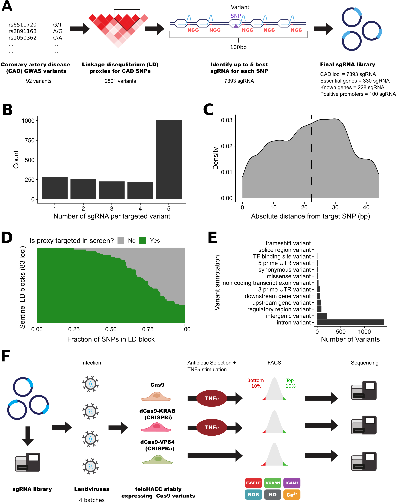

# Multimodal CRISPR CAD

This repository contains all the code to reproduce results and create figures for the manuscript:

[Wünnemann, F. et al. CRISPR perturbations at many coronary artery disease loci impair vascular endothelial cell functions. Preprint at https://doi.org/10.1101/2021.02.10.430527](http://dx.doi.org/10.1101/2021.02.10.430527)

## Data availability

All raw sequencing data for the pooled CRISPR experiments, as well as the RNA-seq validation experiments is publicly available at NCBI Geo under the accession:
[GSE165925](https://www.ncbi.nlm.nih.gov/geo/query/acc.cgi?acc=GSE165925)

## Repository structure

- data - Contains all processed data and tables to produce figures and results.
- figures - Contains all final figures.
- plots - Contains subplots made to create figures.
- references - Contains reference tables (Gene-sets, genome annotations, etc.)
- scripts - Contains all scripts to process data and create figures 
